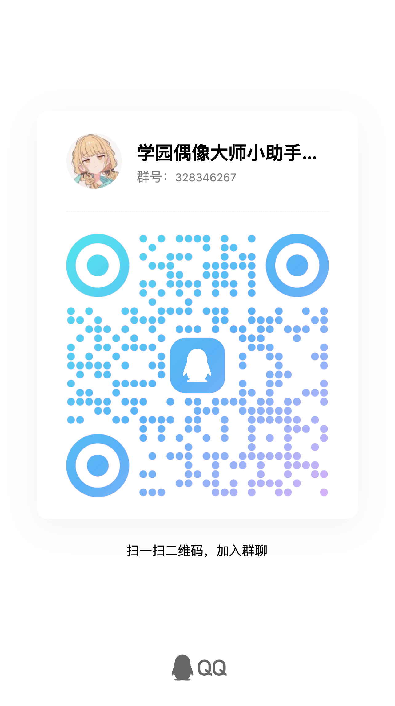

<p align="center">
  
</p>

<div align="center">

# Gakumas Assistant
一个基于 **YOLO + OCR** 的《学园偶像大师》自动化辅助工具  
✨ 如果喜欢 Gakumas Assistant，欢迎在项目右上角点亮 Star 支持 ✨
</div>

<p align="center">
  
  
  <br>
  
  
  
  
</p>


## 功能列表
### 目前已实现
> - 进入游戏
>   - 自动更新游戏
> - 领取活动费
> - 每日派遣
>   - 重新选择任务时长
> - 自动领取邮箱礼物
> - 自动领取任务奖励
> - 自动领取月卡奖励
> - 自动购买每日商店
>   - 自动学习物品信息
>   - 自动刷新商店
> - 自动强化支援卡
>   - 自动升星支援卡
>   - 自动交换多余的支援卡
>   - 自动学习支援卡信息
> - 自动竞技场
> - 自动培育
>   - LLM自动决策
>   - 使用视觉模型自动分析并选择记忆卡卡面

### 待实现/待完善：
> - 工具框架
>   - 任务错误回退
> - 完善任务
> - 新竞技场

## 注意事项
> 现已支持 `Windows`、`macOS`、`Linux` 启动与打包；其中 `PC / DMM` 模式仅支持 `Windows`，`PlayCover+MaaTools`仅支持MacOS平台。  

> 安卓模拟器开发是基于 `MuMu12` 模拟器测试的，因此推荐使用 MuMu12 运行游戏。 其他模拟器若出现问题，请第一时间把脚本根目录下`logs`中的最新的日志文件和相关的`dump`文件上传并截图进行反馈。

> 安卓实体机测试已使用小米9完成

> 汉化插件暂不支持，请手动关闭汉化插件后使用

> 本项目使用 `Yolov26n` 模型进行图像识别。Windows 会优先尝试 `DirectML`，macOS 会优先尝试 `CoreML`，其余平台会自动回退到 `CPUExecutionProvider`。

## 安装
### Plan1: 以打包的方式安装
前往 [Releases](https://github.com/Pigeon-Server/gakumas-assistant/releases) 下载打包后的文件   
运行压缩包内的主程序:
- Windows 为 `Gakumas Assistant.exe`
- macOS 为 `Gakumas Assistant.app`
- Linux 为 `Gakumas Assistant`
更多使用说明参见 [使用手册](./docs/use_script.md)  

### Plan2: 手动安装
克隆及安装项目:
```bash
git clone https://github.com/Pigeon-Server/gakumas-assistant
cd gakumas-assistant
git submodule init
git submodule update --init
python -m venv .venv
source .venv/bin/activate
pip install -r requirements.txt
```
Windows 可将激活命令替换为：
```powershell
.venv\Scripts\Activate.ps1
```
运行项目:
```bash
python app.py
```
说明：
- Windows 安装依赖时会自动安装 `pywin32`，用于 `PC / DMM` 模式。
- macOS / Linux 首次启动会默认进入 `Phone / ADB` 模式；若本机 `pywebview` 后端不可用，程序会自动回退到浏览器模式。
- macOS 上主 ONNX 模型与 OCR 模型都会优先尝试 `CoreMLExecutionProvider`；运行时会在用户缓存目录中保存 ONNX Runtime / CoreML 缓存，若该目录不可写则自动回退到项目内 `.cache`。
- OCR 后端现支持 `auto / rapidocr / vision` 三种策略：`auto` 会在 macOS 上优先尝试原生 `Vision`，失败时自动回退到 `RapidOCR`；其他平台默认继续使用 `RapidOCR`。也可通过环境变量 `GAKUMAS_OCR_BACKEND` 强制覆盖。
- 若环境中尚未缓存 RapidOCR 模型，程序会在首次实际调用 OCR 时按 RapidOCR 默认机制准备模型；执行 `build_app.py` 时也会自动补齐并打包这些模型。
- 在使用LLM自动决策前，建议使用14B以上的模型，保证较高的性能，使用过程中可能会消耗较多的Token，建议本地部署LLM模型

## 免责声明
**请在使用本项目前仔细阅读以下内容。使用本脚本将带来包括但不限于账号被封禁的风险。**

### 总则
该项目是一个为游戏 **《学园偶像大师》（学園アイドルマスター）** 设计的自动操作脚本。本项目的创建目的仅为技术学习与研究，并非为了提供商业服务或鼓励不正当的游戏行为。

### 版权声明
本项目所使用的部分资源文件，包括但不限于图像、音频、模型等，其版权归属于其原始权利人。该游戏的开发商为 **QualiArts**，发行商为**万代南梦宫娱乐（Bandai Namco Entertainment Inc.）**。

1.  **权利归属**：本项目中使用的所有相关游戏资源文件的版权、商标权及其他一切知识产权，均归 **QualiArts**、**万代南梦宫娱乐**或其相关权利方所有。

2.  **非官方性质**：本项目为非官方、非商业性质的开源项目。本项目的开发者与 **QualiArts** 及 **万代南梦宫娱乐**没有任何形式的关联、合作或官方授权。

### 核心风险与责任限制
1.  **账号封禁风险**：**您必须清楚地认识到，使用任何形式的第三方自动操作脚本（包括本项目）都有违反《学园偶像大师》的用户协议（利用規約）的潜在风险。游戏运营商有权对使用此类脚本的账号采取惩罚措施，包括但不限于临时或永久封禁账号。对于因使用本脚本而导致的任何账号损失（如封号、数据回滚等），项目作者概不负责。**

    > - 对本服务的服务器等进行非法访问、窃取数据、使用使软件进行非法处理的程序、使用工具等获取信息或使用工具等不正当推进游戏的行为。
    > - 本サービスのサーバー等への不正アクセス行為、データ窃取行為、ソフトウェアに不正な処理を行わせるプログラムを使用する行為、ツール等を使用して情報を取得する行為またはツール等を使用して不正にゲームを有利に進める行為

2. **使用限制**：本项目的全部内容**严禁用于任何商业用途或恶意破坏游戏平衡的行为**。任何将本项目用于此类活动的行为，均可能构成对版权方的侵权和对游戏运营商的违约，由此产生的一切法律责任由使用者自行承担。

3. **无担保与责任限制**：本项目按“原样”提供，不附带任何形式的明示或暗示担保，包括其功能的稳定性、准确性或持续可用性。对于因使用或无法使用本项目而导致的任何直接、间接、偶然、特殊或继发性损害（**包括但不限于账号封禁**），项目作者概不负责。

**继续下载、安装或使用本项目，即表示您已完全阅读、理解并同意承担以上所有风险和条款。如果您不同意，请立即停止使用并删除本项目的所有相关文件。**

## 开发
> 贡献代码时请注意:
> 1. 尽可能不硬编码坐标等参数
> 2. 尽可能不包含游戏中的资产

### **安装环境:**  
推荐使用 uv（一款速度极快的 Python 环境管理器）来创建和管理 Python 环境。  
请先按照官方文档完成 uv 的安装：  
👉 https://docs.astral.sh/uv/getting-started/installation  
安装完成后，可使用以下命令创建虚拟环境并安装依赖：
```bash
uv venv --python 3.12 --seed
source .venv/bin/activate
uv pip install -r requirements.dev.txt
```
如果你更习惯使用传统的 `pip`，也可以使用以下方式：  
```bash
python -m venv venv
source .venv/bin/activate
pip install -r requirements.dev.txt
```
> PS：  
> 建议创建两个环境用于开发和打包:
> 开发环境安装 `requirements.dev.txt`
> 打包环境安装 `requirements.build.txt`
> 中国大陆网络环境可使用 requirements.dev.cn.txt 或 requirements.build.cn.txt 以提高依赖安装成功率。
### **拉取子模块:**
本项目包含 Git 子模块，请在克隆仓库后执行：
```bash
git submodule init
git submodule update --init
```
### **YOLO检测模型训练:**  
#### 训练：
该项目基于 YOLO v26 Nano，并训练两个独立模型，分别负责主界面识别与训练界面识别。训练脚本位于 train/<model_name>/train.py。

- BaseUI 模型：使用约 4.1K 张有效样本训练，用于主 UI 的目标检测。
- Producer 模型：使用约 2K 张样本训练，用于训练界面的检测任务。

两个模型均根据其应用场景独立优化，以获得更高的识别精度和更稳定的推理效果。
#### 数据集：
> 待脱敏后开放，如有需要请联系**skyfsj@qq.com**  
#### 导出推理模型:
导出脚本会导出所有模型,请在项目根运行导出脚本
```bash
python ./devtools/model_export.py
```
### 打包项目:
本项目使用 `Nuitka` 进行打包，支持 `Windows`、`macOS`、`Linux`。打包后的应用程序会输出到 `out/` 中。
```bash
pip install -r requirements.build.txt
python build_app.py
```
如需切换运行时可写目录位置，可在打包时指定存储模式：
```bash
python build_app.py --portable
python build_app.py --merged
```
说明：
- Windows 输出主程序为 `out/Gakumas Assistant.dist/Gakumas Assistant.exe`
- macOS `--portable` 输出文件夹为 `out/Gakumas Assistant`
- macOS `--merged` 输出应用包为 `out/Gakumas Assistant.app`
- Linux 输出主程序为 `out/Gakumas Assistant.dist/Gakumas Assistant`
- 若当前环境未安装 `upx`，打包脚本会自动跳过 UPX 压缩
- `--portable` 会把 `.cache`、`assets`、`data`、`logs` 放在程序同目录
- `--merged` 会把上述目录放到用户主目录下的 `.gakumas-assistant/`
- Windows 下：`--portable` 产物带控制台，`--merged` 默认不带控制台
- macOS 下：`--portable` 为浏览器版，不内置 WebView，输出普通文件夹；`--merged` 继续输出原生 `.app`

## 许可证
Copyright © 2020-2025 Pigeon Server Team, All rights reserved.

Licensed under The GNU General Public License version 3 (GPLv3) (the "License"); you may not use this file except in compliance with the License. You may obtain a copy of the License at

https://www.gnu.org/licenses/gpl-3.0.html

Unless required by applicable law or agreed to in writing, software distributed under the License is distributed on an "AS IS" BASIS, WITHOUT WARRANTIES OR CONDITIONS OF ANY KIND, either express or implied. See the License for the specific language governing permissions and limitations under the License.

### 致谢
本项目主要用到了以下开源项目与社区资源，感谢各位作者和维护者的付出：
- **[GkmasObjectManager](https://github.com/AllenHeartcore/GkmasObjectManager)**  
游戏资源提取器
- **[campus](https://github.com/vertesan/campus)**  
游戏数据库提取工具  
- **[gakumasu-diff](https://github.com/vertesan/gakumasu-diff)**  
游戏数据
- **[GakumasTranslationData](https://github.com/chinosk6/GakumasTranslationData.git)**  
游戏文本翻译
- **[Gakumas_Launcher](https://github.com/a4nqi3n/Gakumas_Launcher)**  
脱离DMMPlayer启动游戏
- **[学园偶像大师-萌娘百科Wiki页面](https://zh.moegirl.org.cn/%E5%AD%A6%E5%9B%AD%E5%81%B6%E5%83%8F%E5%A4%A7%E5%B8%88)｜[学园偶像大师板块-GameKee](https://www.gamekee.com/gakumas/) ｜ [学园偶像大师板块-WikiWiki(日语)](https://wikiwiki.jp/gakumas/)**  
游戏术语/逻辑补充
- **[Ultralytics](https://github.com/ultralytics/ultralytics)**  
YOLO 训练、导出与推理工具链
- **[RapidOCR](https://github.com/RapidAI/RapidOCR)**  
OCR 能力与模型封装
- **[ONNX Runtime](https://github.com/microsoft/onnxruntime)**  
模型推理引擎
- **[adbutils](https://github.com/openatx/adbutils)** 与 **[uiautomator2](https://github.com/openatx/uiautomator2)**  
Android 设备通信与自动化控制
- **[scrcpy](https://github.com/Genymobile/scrcpy)**、**[MaaTouch](https://github.com/MaaAssistantArknights/MaaTouch)**、**[minitouch](https://github.com/openstf/minitouch)**、**[DroidCast](https://github.com/rayworks/DroidCast)**  
Android 控制、触控与投屏相关能力
- **[Vue](https://github.com/vuejs/core)**、**[Vuetify](https://github.com/vuetifyjs/vuetify)** 与 **[Vite](https://github.com/vitejs/vite)**  
Web UI 基础设施

随包分发的二进制依赖来源与版权说明见 [bin/THIRD_PARTY_NOTICES.md](./bin/THIRD_PARTY_NOTICES.md)。

## 联系方式
Email: **skyfsj@qq.com**  
QQ Group: **328346267**


## Star History

<a href="https://www.star-history.com/?repos=Pigeon-Server%2Fgakumas-assistant&type=date&legend=top-left">
 <picture>
   <source media="(prefers-color-scheme: dark)" srcset="https://api.star-history.com/chart?repos=Pigeon-Server/gakumas-assistant&type=date&theme=dark&legend=top-left" />
   <source media="(prefers-color-scheme: light)" srcset="https://api.star-history.com/chart?repos=Pigeon-Server/gakumas-assistant&type=date&legend=top-left" />
   
 </picture>
</a>